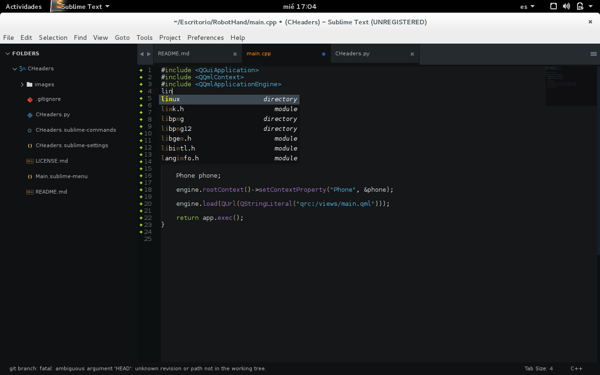
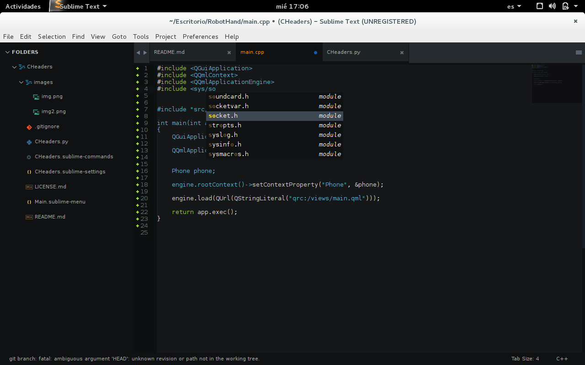
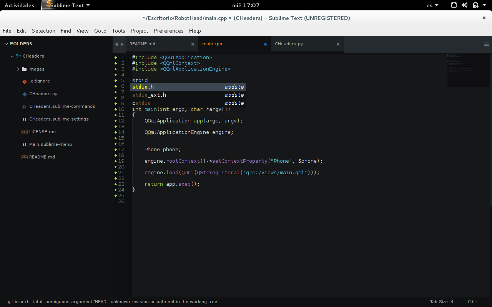
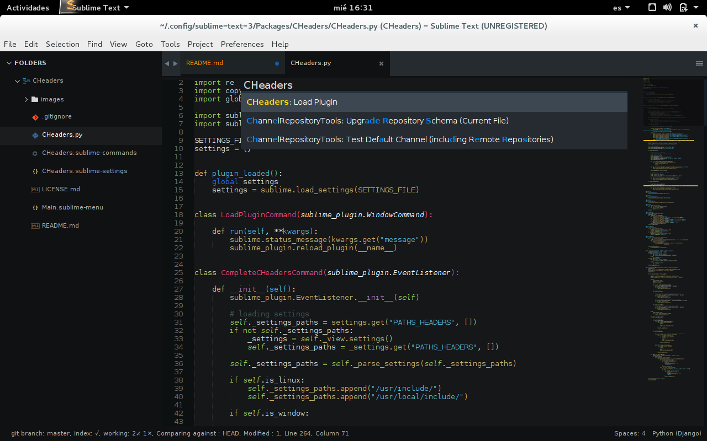

CHeaders.
==========

CHeaders it's a open source sublime text plugin, designed 
to help you to find c/c++ headers files.

By default, CHeaders will find c/c++ headers at default 
locations, both windows and linux.

###Linux default locations.
**/usr/include**
**/usr/local/include**

###Window default locations.
**C:\\Mingw\\include**


Usage.
======

All you need to do is write the library you want to look.





If the plugin does not work well, just press Ctrl+shift+p(linux, windows), then
find the command **CHeaders: Load Plugin** and press enter, and then, the CHeaders 
plugin shall work correctly...




Configuring.
============

For adding additional c/c++ headers files paths
to CHeaders, just add the path to PATH_HEADERS.

```json
{
    "PATHS_HEADERS" : ["~/Desktop/project/include"],
}
```


LICENCE.
========

(The MIT License)

Copyright (C) 2015 Leonardo Esparis.

Permission is hereby granted, free of charge, to any person obtaining a copy
of this software and associated documentation files (the "Software"), to deal
in the Software without restriction, including without limitation the rights
to use, copy, modify, merge, publish, distribute, sublicense, and/or sell
copies of the Software, and to permit persons to whom the Software is
furnished to do so, subject to the following conditions:

The above copyright notice and this permission notice shall be included in
all copies or substantial portions of the Software.

THE SOFTWARE IS PROVIDED "AS IS", WITHOUT WARRANTY OF ANY KIND, EXPRESS OR
IMPLIED, INCLUDING BUT NOT LIMITED TO THE WARRANTIES OF MERCHANTABILITY,
FITNESS FOR A PARTICULAR PURPOSE AND NONINFRINGEMENT. IN NO EVENT SHALL THE
AUTHORS OR COPYRIGHT HOLDERS BE LIABLE FOR ANY CLAIM, DAMAGES OR OTHER
LIABILITY, WHETHER IN AN ACTION OF CONTRACT, TORT OR OTHERWISE, ARISING FROM,
OUT OF OR IN CONNECTION WITH THE SOFTWARE OR THE USE OR OTHER DEALINGS IN THE
SOFTWARE.


Contributor.
============

- [x] Leonardo Esparis  leo.leo.leoxnidas.c.14@gmail.com